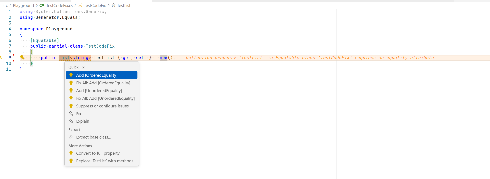

# Nall.Generator.Equals.Analyzers

A Roslyn analyzer for the [Generator.Equals](https://github.com/diegofrata/Generator.Equals) library that ensures proper equality attribute usage on collection properties.

## Features

- **Smart Diagnostics**: Detects collection properties in `[Equatable]` classes that lack required equality attributes
- **Intelligent Code Fixes**: Provides collection-specific attribute suggestions:
  - `Dictionary<TKey,TValue>` → `[DictionaryEquality]`
  - `HashSet<T>` / `ISet<T>` → `[SetEquality]`
  - `List<T>` / `Array` / `IEnumerable<T>` → `[OrderedEquality]` or `[UnorderedEquality]`

## Example Usage

### Before (Triggers GE001 Warning)
```csharp
[Equatable]
public partial class MyClass
{
    public List<string> Items { get; set; } // ⚠️ GE001: Missing equality attribute
    public Dictionary<string, int> Data { get; set; } // ⚠️ GE001: Missing equality attribute
}
```

### After (With Code Fixes Applied)
```csharp
[Equatable]

public partial class MyClass
{
    [UnorderedEquality] // or [OrderedEquality]
    public List<string> Items { get; set; }

    [DictionaryEquality]
    public Dictionary<string, int> Data { get; set; }
}
```

Example of code fix suggestions:


## Installation
```bash
dotnet add package Nall.GeneratorEquals.Analyzers
```